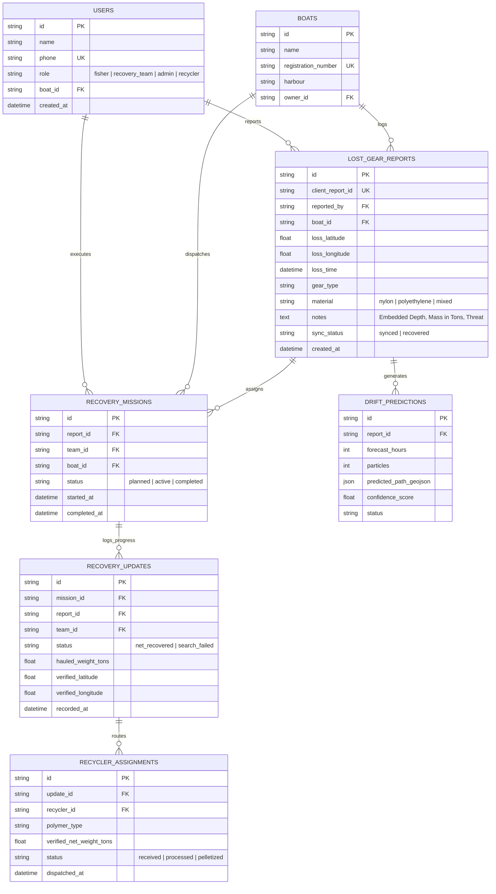

# GhostNet AI — Full System Architecture Specification

**Project Title:** GhostNet AI: Autonomous Marine Conservation, Subsea Acoustic Intelligence & Circular Plastic Platform  
**Pilot Location:** Kasimedu Fishing Harbour & Chennai Coastline, Bay of Bengal  
**Domain Category:** Smart and Sustainability Development  
**Target Environment:** Zero-Connectivity Maritime Edge to Cloud Distributed Topology  
**Production Endpoints:**
- **Cloud Backend API (Railway):** `https://ghostnet-ai-production.up.railway.app`
- **Mobile Client & GIS Command Center (Vercel):** `https://ghostnet-ai-mobile.vercel.app`

---

## 1. Executive Summary & Environmental Problem Context

Abandoned, Lost, or otherwise Discarded Fishing Gear (ALDFG or "ghost nets") constitutes one of the most destructive forms of marine pollution, accounting for an estimated 640,000 metric tons of plastic entering global oceans annually. In shallow and coastal waters, synthetic nylon nets (primarily Polyamide-6 / Nylon-6) persist for over 600 years without biodegrading. They perpetuate an endless, uncontrolled cycle of "ghost fishing"—indiscriminately snaring, suffocating, and killing endangered marine fauna, including the endangered **Olive Ridley sea turtles (*Lepidochelys olivacea*)** along the Chennai nesting coastline (Marina, Besant Nagar, Neelankarai). Over time, mechanical wave shear and ultraviolet radiation degrade these macro-nets into billions of toxic microplastic fibers that bioaccumulate in pelagic fisheries and coastal human seafood chains.

### The Critical Operational Salvage Flaw
Traditional marine recovery initiatives suffer from severe systemic failure points:
1. **Reporting Latency & Communication Breakdown:** Incident reporting tools require active cellular internet, which completely disconnects beyond 3 nautical miles offshore.
2. **Dynamic Ocean Drift:** Nets do not remain stationary; Bay of Bengal monsoonal currents drift submerged gear several nautical miles daily.
3. **Subsea Optical Invisibility:** In deep, turbid coastal waters, submerged nets are completely invisible to the human eye from vessel decks. Without acoustic subsea imaging, recovery crews waste hundreds of hours performing "blind grappling" runs with near-zero success rates.
4. **Linear Disposal Fallacy:** Recovered gear is historically dumped into municipal landfills or incinerated, creating secondary terrestrial pollution instead of circular material loops.

### The GhostNet AI Solution
GhostNet AI bridges this gap through a distributed, edge-to-cloud architecture designed for extreme maritime resilience:
- **Offline-First Incident Declaration** at sea with opportunistic store-and-forward outbox synchronization.
- **Lagrangian Hydrodynamic Drift Prediction Engine** forecasting 72-hour drift vectors.
- **Edge AI Subsea Side-Scan Sonar (SSS) Acoustic Target Lock** executing zero-cloud, on-device neural network classification of submerged nylon webbing and rendering precision grappling vectors.
- **Circular Economy Chain-of-Custody Ledger** routing verified recovered polymers (in Metric Tons) to certified recyclers (*Chennai EcoPlast Circular Solutions*).
- **Full-Screen GIS Marine Command Center** delivering real-time spatial oversight to port authorities and marine conservation bodies.

---

## 2. United Nations Sustainable Development Goals (SDG) Alignment

| UN SDG Goal | Target Metric | System Realization |
| :--- | :--- | :--- |
| **SDG 14: Life Below Water** | Target 14.1 (Reduce Marine Pollution) & 14.2 (Protect Marine Ecosystems) | Eradicates ghost fishing mortality in Olive Ridley turtle corridors; cleans benthic ocean habitats; prevents billions of microplastic fibers from shedding. |
| **SDG 12: Responsible Consumption** | Target 12.5 (Substantially Reduce Waste Generation via Recycling) | Diverts 100% of hauled Nylon-6 polymers to circular industrial upcycling (depolymerization into engineering pellets and circular textiles). |
| **SDG 13: Climate Action** | Target 13.2 (Integrate Climate Measures) | Avoids ~5.5 Metric Tons of $\text{CO}_2\text{e}$ emissions per ton of recycled marine Nylon-6 versus virgin fossil-fuel nylon synthesis. |

---

## 3. End-to-End Operational Lifecycle & Data Transitions

```
[Phase 1: Incident Declaration]
Offshore (Zero Connectivity) • Maritime Stakeholder
• Logs loss GPS coordinates, depth (m), estimated mass (Metric Tons), threat tier, polymer type.
• Persisted locally to SQLite with idempotent client UUID in outbox queue.
              ↓
[Phase 2: Opportunistic Sync & Simulation]
Harbour / Cellular Range • Sync Daemon & Cloud Worker
• NetInfo detects network restore; executes batch POST to /api/v1/reports/lost-gear.
• Backend triggers hydrodynamic simulation; computes 72h forward drift vectors.
              ↓
[Phase 3: Mission Dispatch & Collision Lock]
Harbour / HQ • Recovery Vessel
• Rescue team inspects target; claims assignment.
• System sets multi-crew mission collision lock to prevent duplicate deployments.
              ↓
[Phase 4: Navigation to Search Corridor]
Offshore (Zero Connectivity) • Recovery Vessel
• Vessel navigates offshore using live GPS heading and cached nautical search corridors.
• System computes real-time distance (NM) and AIS bearing vectors.
              ↓
[Phase 5: Edge AI Subsea Sonar Acoustic Scan]
Target Zone (Zero Connectivity) • Vessel Onboard Computer
• Vessel deploys Side-Scan Sonar (SSS) towfish on physical tether cable.
• Embedded ONNX model analyzes acoustic waterfall backscatter (<30ms inference).
• Distinguishes synthetic nylon net from seabed benthos/reefs (Confidence >90%).
• HUD locks target depth & renders real-time vessel heading + grappling vector.
              ↓
[Phase 6: On-Deck Verification & Custody Ledger]
On Deck • Recovery Crew
• Crew winches net to deck; logs verified haul weight (in Metric Tons).
• Permanently clears incident from active emergency queue.
              ↓
[Phase 7: Circular Economy Transfer & Admin GIS Oversight]
Harbour / Recycling Facility • Port Master & Circular Recycler
• Synchronizes verified recovery record to cloud ledger upon return to harbour.
• Generates chain-of-custody transfer to Chennai EcoPlast Circular Solutions.
• Admin GIS Dashboard updates spatial map (🔴 Hazard → 🟢 Recovered) and increments ecological KPI counters.
```

---

## 4. Multi-Tier Distributed System Architecture

```mermaid
flowchart TB
    subgraph Tier1 ["Tier 1: Maritime Field Edge (Zero Internet at Sea)"]
        MobileClient["Mobile Web Client (React Native / Expo)"]
        LocalQueue[("Offline Outbox Queue / Local SQLite")]
        SonarHardware["Side-Scan Sonar (Towfish / Hull Transducer)"]
        EdgeAI["Edge AI Acoustic Vision Engine (ONNX / YOLOv8 Embedded)"]
        GrappleHUD["Precision Grappling & Heading Guidance HUD"]
        
        MobileClient <--> LocalQueue
        SonarHardware -->|Raw Acoustic Ping Stream (USB/Ethernet)| EdgeAI
        EdgeAI -->|Target Coordinates + Depth + Bearing| GrappleHUD
        GrappleHUD --> MobileClient
    end

    subgraph Tier2 ["Tier 2: Ingestion & Cloud API Gateway"]
        SyncManager["Opportunistic Store-and-Forward Sync Daemon"]
        FastAPIApp["FastAPI Async Core (Python 3.11 / Uvicorn)"]
        AuthRBAC["JWT Security & Multi-Role Access Control"]
        
        LocalQueue -.->|Batch Upload upon Harbour Docking| SyncManager
        SyncManager --> FastAPIApp
        FastAPIApp --> AuthRBAC
    end

    subgraph Tier3 ["Tier 3: Simulation & Intelligence Engine"]
        DriftModel["Lagrangian Particle Drift Simulation Engine"]
        MeteoAPI["Marine Meteorological Service (Open-Meteo / INCOIS)"]
        CollisionLock["Multi-Crew Mission Dispatch & Conflict Resolver"]
        
        FastAPIApp --> DriftModel
        MeteoAPI --> DriftModel
        FastAPIApp --> CollisionLock
    end

    subgraph Tier4 ["Tier 4: Enterprise Persistence & Circular Ledger"]
        CentralDB[("Cloud PostgreSQL / SQLite Database")]
        RecyclePipeline["Circular Plastic Chain-of-Custody (Chennai EcoPlast)"]
        ImpactEngine["Ecological Impact & Carbon Offset Engine"]
        
        FastAPIApp <--> CentralDB
        CentralDB --> RecyclePipeline
        CentralDB --> ImpactEngine
    end

    subgraph Tier5 ["Tier 5: Marine GIS Admin Command Center"]
        AdminMap["Full-Screen Satellite Marine GIS Map (Leaflet)"]
        LivePins["Live Status Markers (🔴 Hazard | 🔵 In Action | 🟢 Recovered)"]
        EcoCounters["Ecological Counters (Tons Hauled | Microplastics | CO₂e)"]
        
        CentralDB --> AdminMap
        AdminMap --> LivePins
        AdminMap --> EcoCounters
    end
```

---

## 5. Technical Specifications by System Tier

### 5.1 Tier 1: Maritime Field Edge & Subsea Acoustic AI
* **Framework:** React Native Web (Expo SDK 51) with MapLibre / Leaflet GIS integration.
* **Storage Engine:** Browser LocalStorage / Persistent SQLite store with offline FIFO outbox queue.
* **Side-Scan Sonar Subsea AI Module:**
  - **Hardware Interface:** High-frequency Side-Scan Sonar (450 kHz / 900 kHz) deployed via towfish tether or hull-mounted transducer, interfacing via physical Ethernet/USB to vessel ruggedized computer.
  - **Model Architecture:** Embedded lightweight Convolutional Neural Network / Vision Transformer (YOLOv8-Nano / MobileNetV3 quantized in ONNX runtime).
  - **Inference Latency:** $<30 \text{ ms}$ on local standard CPU/GPU; zero internet dependence.
  - **Feature Extraction:** Evaluates acoustic backscatter intensity differential:
    - *Synthetic Nylon-6 Webbing:* Produces characteristic high-density, multi-nodal acoustic shadow with irregular webbed geometry.
    - *Natural Seabed Matrix:* Uniform low-reflection backscatter (soft silt) or discrete hard-edged specular reflections (geological rock/coral).
  - **Output Telemetry:** Subsea relative distance ($m$), depth below transducer ($m$), relative bearing ($\theta$), and visual guidance vector for vessel winch deployment.

### 5.2 Tier 2: Cloud Backend & Microservices
* **Runtime:** Python 3.11 with FastAPI (Asynchronous ASGI).
* **Database Layer:** SQLAlchemy 2.0 ORM with PostgreSQL / SQLite (`ghostnet_dev.db`).
* **Containerization:** Docker multi-stage container deployed on Railway (`https://ghostnet-ai-production.up.railway.app`).
* **CORS & Networking:** Configured with zero-trust token authentication (OAuth2 / JWT Bearer) and global cross-origin allowances for edge clients.

### 5.3 Tier 3: Hydrodynamic Drift Prediction Engine
* **Physical Model:** 2D/3D Lagrangian Particle Trajectory Simulation:
  $$\vec{V}_{\text{drift}} = \alpha \vec{U}_{\text{current}} + \beta \vec{W}_{\text{wind}} + \vec{S}_{\text{stokes}}$$
  - $\vec{U}_{\text{current}}$: Ocean surface current velocity (knots).
  - $\vec{W}_{\text{wind}}$: 10-meter wind vector (leeway coefficient $\beta \approx 0.02 - 0.04$ for submerged nets).
  - $\vec{S}_{\text{stokes}}$: Wave Stokes drift velocity based on significant wave height and period.
* **Forecast Range:** 24h, 48h, and 72h forward cone of uncertainty with GeoJSON spatial polygon output.

### 5.4 Tier 4: Circular Economy Ledger
* **Unit of Measure:** Standardized to **Metric Tons** across declaration, verification, and recycling.
* **Custody Routing:** Automates material routing to certified recyclers:
  - *Partner Recycler:* Chennai EcoPlast Circular Solutions (Kasimedu Industrial Cluster).
  - *Polymer Classification:* Monofilament Nylon-6, Polyethylene (PE), Polypropylene (PP).
  - *Conversion Process:* Mechanical washing $\rightarrow$ shredding $\rightarrow$ thermal depolymerization $\rightarrow$ circular engineering pellets.

### 5.5 Tier 5: Marine GIS Admin Command Center
* **Interface:** Full-screen responsive satellite GIS command dashboard.
* **Visual Topology:**
  - 🔴 **Red Markers:** Active Unrecovered Ghost Nets (with dynamic drift vectors).
  - 🔵 **Blue Markers:** Rescue Vessels Currently Deployed (with active Side-Scan Sonar status).
  - 🟢 **Green Markers:** Successfully Recovered Net Sites (with verified hauled tonnage).
* **Automated Ecological Metrics:**
  - $\text{Total Polymer Diverted } (\text{Metric Tons}) = \sum \text{Verified Hauls}$
  - $\text{Microplastics Prevented } = \text{Tons Recovered} \times 2.8 \times 10^9 \text{ fibers/ton}$
  - $\text{Carbon Offset } (\text{Metric Tons } \text{CO}_2\text{e}) = \text{Tons Nylon-6 Recycled} \times 5.5$
  - $\text{Clean Ocean Habitat Area Restored } (\text{km}^2)$

---

## 6. Database Entity-Relationship Architecture



---

## 7. Comparative Technical Benchmark

| Capability | Generic Marine Cleanup Apps | Ocean Sampling Buoys | GhostNet AI Platform |
| :--- | :--- | :--- | :--- |
| **Operating Connectivity** | Strict 4G/5G requirement | Satellite uplink only (\$1,200/yr) | **100% Offline Edge AI + Store-and-Forward** |
| **Subsea Search Mechanism**| Visual lookout from boat deck | Surface position beacon only | **Side-Scan Sonar Edge AI Acoustic Target Lock** |
| **Acoustic Inference** | None | None | **On-device ONNX Neural Network (<30ms)** |
| **Ocean Drift Simulation** | Static coordinates | Drift buoy GPS tracks | **72h Lagrangian Particle Drift Hydrodynamics** |
| **Mass Standardization** | Arbitrary kg text | None | **Maritime Metric Tons (0.1 Ton precision)** |
| **Fleet Coordination** | Uncoordinated / Clashing | Uncoordinated | **Multi-Crew Collision Locking Protocol** |
| **Post-Recovery Lifecycle**| Landfill disposal / Unmanaged | None | **Verified Circular Upcycling (Nylon-6 Pellets)** |
| **Deployment Status** | Mockup / Academic Paper | Specialized Hardware | **Production Live on Railway & Vercel** |

---

## 8. Scalability & Future Roadmap

1. **Autonomous Underwater Vehicle (AUV) Integration:** Interfacing GhostNet AI's acoustic inference model with robotic submersibles for autonomous underwater net cutting and retrieval at depths beyond 50 meters.
2. **Satellite Synthetic Aperture Radar (SAR):** Integrating Sentinel-1 SAR backscatter analytics to automatically detect surface macro-net slicks across the open Bay of Bengal prior to coastal drifting.
3. **Pan-Indian Coastal Port Federation:** Expanding the Kasimedu pilot to major fishing harbours across Tamil Nadu, Kerala, Karnataka, and Andhra Pradesh (Tuticorin, Cochin, Mangalore, and Visakhapatnam).
