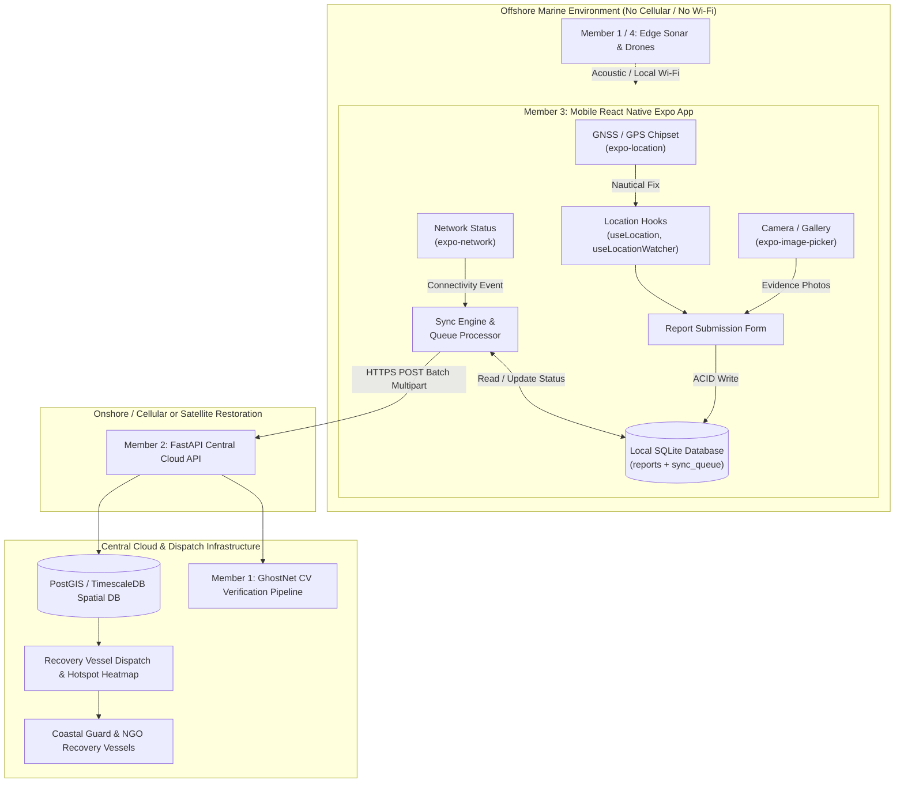
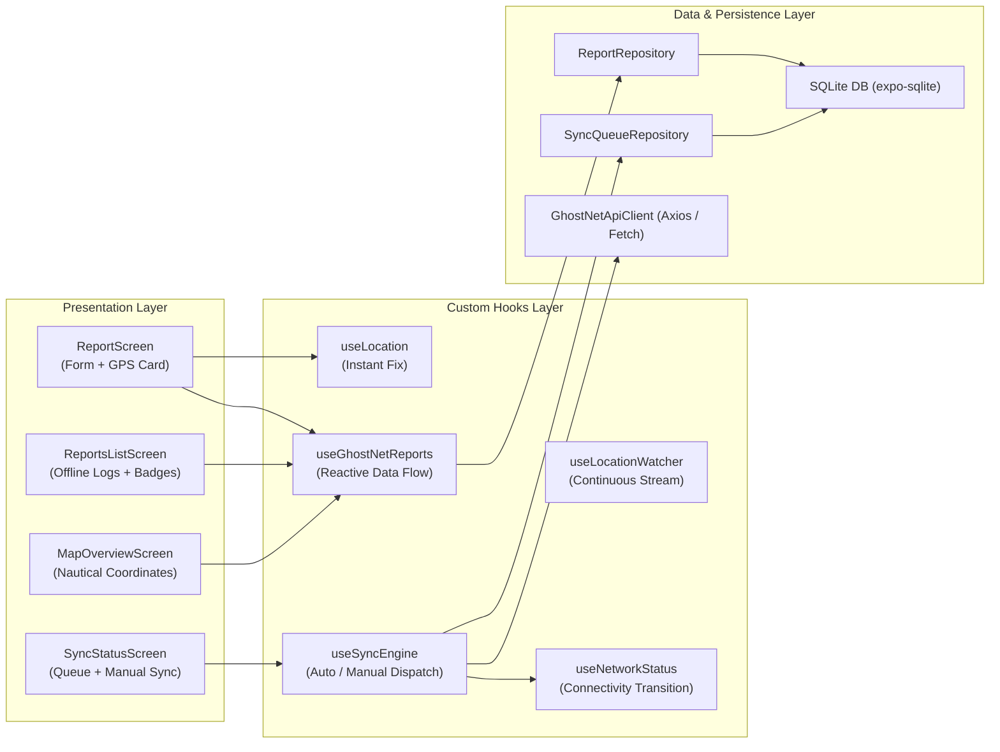
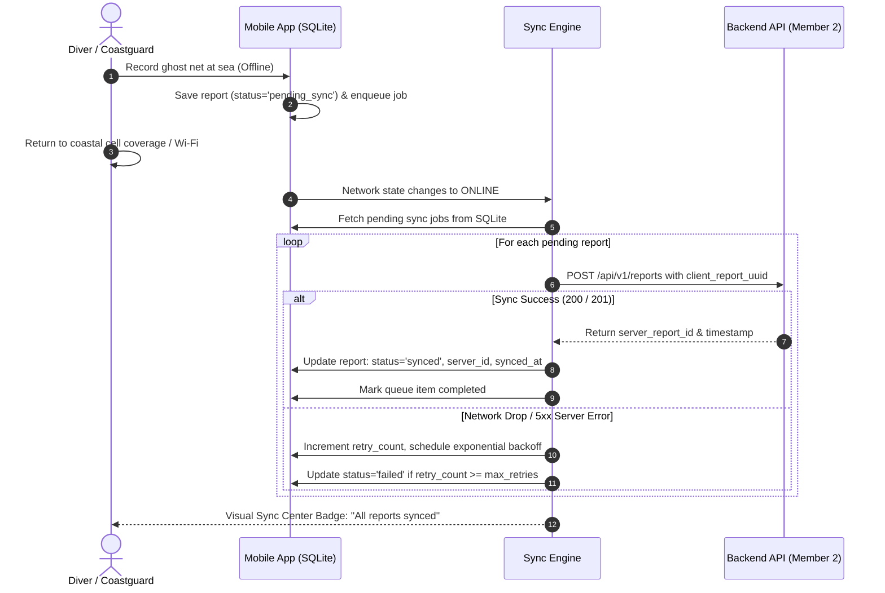

# GhostNet AI — System Architecture Specification

## 1. System Vision & Architecture Overview

GhostNet AI provides an autonomous, end-to-end operational pipeline to detect, report, monitor, and remove Abandoned, Lost, or Discarded Fishing Gear (ALDFG) across open oceans and coastal sanctuaries.

The system connects four operational nodes:
1. **Edge Computer Vision (Member 1):** Real-time image segmentation and sonar echo analysis.
2. **Central Spatial Backend (Member 2):** GeoJSON processing, risk prioritization, recovery dispatch.
3. **Mobile First-Responder Client (Member 3):** Offline-first reporting, GNSS/GPS tracking, SQLite persistence.
4. **Marine Telemetry & Buoy Node (Member 4):** IoT acoustic transponder, LoRa / satellite gateway.



---

## 2. Mobile Client Architecture (`mobile/`)

The mobile client is engineered for high resilience under harsh offshore conditions:



---

## 3. Offline-First SQLite Database Schema

The mobile SQLite database (`ghostnet_ai.db`) uses the following schema design:

### 3.1 `reports` Table
Stores all incident logs captured locally on device.

```sql
CREATE TABLE IF NOT EXISTS reports (
    id INTEGER PRIMARY KEY AUTOINCREMENT,
    uuid TEXT UNIQUE NOT NULL,
    latitude REAL NOT NULL,
    longitude REAL NOT NULL,
    accuracy REAL NOT NULL,
    altitude REAL DEFAULT 0,
    depth_meters REAL DEFAULT 0,
    net_type TEXT NOT NULL CHECK(net_type IN ('gillnet', 'trawl', 'purse_seine', 'longline', 'trap_pot', 'unknown')),
    threat_level TEXT NOT NULL CHECK(threat_level IN ('low', 'medium', 'high', 'critical')),
    estimated_length REAL DEFAULT 0,
    estimated_width REAL DEFAULT 0,
    entangled_wildlife INTEGER NOT NULL DEFAULT 0,
    wildlife_notes TEXT DEFAULT '',
    notes TEXT DEFAULT '',
    photo_uris TEXT DEFAULT '[]', -- JSON string of local file paths
    status TEXT NOT NULL DEFAULT 'pending_sync' CHECK(status IN ('draft', 'pending_sync', 'synced', 'failed')),
    server_id TEXT DEFAULT NULL,
    created_at INTEGER NOT NULL,
    updated_at INTEGER NOT NULL,
    synced_at INTEGER DEFAULT NULL
);

CREATE INDEX IF NOT EXISTS idx_reports_status ON reports(status);
CREATE INDEX IF NOT EXISTS idx_reports_created_at ON reports(created_at);
```

### 3.2 `sync_queue` Table
Tracks outbound sync jobs with retry counters and backoff intervals.

```sql
CREATE TABLE IF NOT EXISTS sync_queue (
    id INTEGER PRIMARY KEY AUTOINCREMENT,
    report_uuid TEXT NOT NULL,
    action TEXT NOT NULL DEFAULT 'CREATE' CHECK(action IN ('CREATE', 'UPDATE', 'DELETE')),
    payload TEXT NOT NULL, -- JSON serialized report data
    retry_count INTEGER NOT NULL DEFAULT 0,
    max_retries INTEGER NOT NULL DEFAULT 5,
    last_error TEXT DEFAULT NULL,
    status TEXT NOT NULL DEFAULT 'pending' CHECK(status IN ('pending', 'in_progress', 'completed', 'permanently_failed')),
    created_at INTEGER NOT NULL,
    updated_at INTEGER NOT NULL,
    FOREIGN KEY(report_uuid) REFERENCES reports(uuid) ON DELETE CASCADE
);

CREATE INDEX IF NOT EXISTS idx_sync_queue_status ON sync_queue(status);
```

---

## 4. GPS & Geolocation Operational Requirements

1. **Satellite GNSS Fix**:
   - Must request `Location.Accuracy.Highest` (or `BestForNavigation`) for marine coordinates.
   - Maritime standards accept coordinate fixes with an accuracy circle $\le 15.0\text{ meters}$.
   - Coordinates are maintained in standard WGS-84 decimal degrees ($lat, lon$) and also formatted in human-readable Nautical Degrees-Minutes-Seconds ($DD^\circ MM' SS''\text{ [N/S/E/W]}$).
2. **Marine Vessel Tracking**:
   - `useLocationWatcher` allows continuous background or foreground updates with configurable time ($5000\text{ms}$) and distance intervals ($10\text{m}$).
   - Low-power mode falls back to cell-tower/Wi-Fi when docked onshore.

---

## 5. Synchronization & Idempotency Protocol

To prevent duplicate incident reports when re-transmitting over intermittent 2G/3G marine coastal signals:



1. **Client-Generated UUIDs**: Every report is assigned a cryptographically random RFC 4122 UUID at the moment of recording. The backend deduplicates incoming payloads using this key.
2. **Exponential Backoff**: If an upload fails due to network dropouts:
   $$\text{Backoff Interval} = \min(2^{\text{retry\_count}} \times 1000\text{ms}, 60000\text{ms}) + \text{jitter}$$
3. **Photo Optimization**: Local photos captured via camera are compressed to JPEG (80% quality, max dimension 1920px) before upload to save offshore satellite/cellular bandwidth.

---

## 6. Directory Structure (`mobile/`)

```
mobile/
├── package.json
├── app.json
├── tsconfig.json
├── babel.config.js
├── App.tsx
├── README.md
└── src/
    ├── types/
    │   ├── report.ts
    │   ├── location.ts
    │   └── network.ts
    ├── services/
    │   ├── database/
    │   │   ├── sqlite.ts
    │   │   ├── reportRepository.ts
    │   │   └── syncQueueRepository.ts
    │   └── api/
    │       └── ghostNetApi.ts
    ├── hooks/
    │   ├── useLocation.ts
    │   ├── useLocationWatcher.ts
    │   ├── useNetworkStatus.ts
    │   ├── useGhostNetReports.ts
    │   └── useSyncEngine.ts
    ├── components/
    │   ├── GPSStatusCard.tsx
    │   ├── NetworkBanner.tsx
    │   ├── ReportCard.tsx
    │   └── ThreatBadge.tsx
    ├── screens/
    │   ├── ReportScreen.tsx
    │   ├── ReportsListScreen.tsx
    │   ├── SyncStatusScreen.tsx
    │   ├── MapOverviewScreen.tsx
    │   └── ReportDetailScreen.tsx
    └── utils/
        ├── formatters.ts
        └── uuid.ts
```
