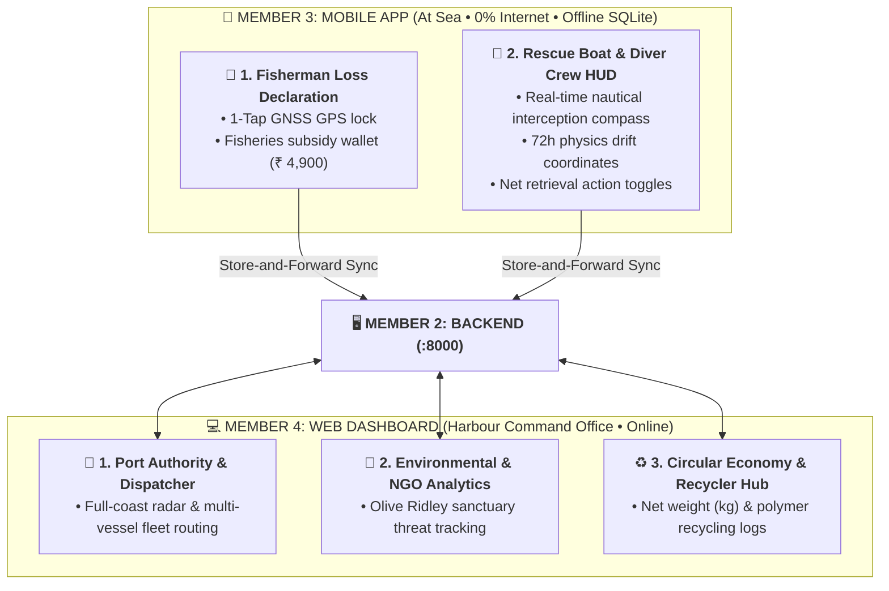

# 📱 GhostNet AI — Mobile Client (Member 3 Handover Dossier)

> **Offline-First Marine ALDFG Tactical Reporting & Recovery Mobile Platform**  
> **Prepared For:** Member 3 (Mobile Lead & Edge Systems Engineer)  
> **Repository Path:** `mobile/` in `netghostgit/mobile`  
> **Core Stack:** React Native, Expo SDK 51, TypeScript (`.tsx`), Local SQLite Architecture, Geolocation GNSS.

---

## 1. 🌊 Operational Scope: Mobile vs Web Dashboard Architecture

---

## 2. 🏛️ Key Features Built in `App.tsx`

### A. 🛡️ Dual-Role Marine Portal
1. **🎣 Kasimedu Fisherman Loss Declaration:**
   * Rapid 1-tap satellite GPS capture in nautical DMS (`13° 07' 30.0" N, 80° 18' 54.0" E`).
   * **Government Subsidy & Incentive Wallet (`₹ 4,900 Earned`)** for reporting lost nets.
2. **🤿 Rescue Boat & Diver Crew Tactical HUD:**
   * **Rotating Nautical Interception Compass** (Bearing `42° NNE`, Distance `2.4 NM`).
   * **Submergence Golden Window Countdown** (`38h Remaining Before Sinking`) tracking the biofouling threshold.
   * **+24h, +48h, and +72h AI Interception Coordinates** computed by Member 1's physics engine.
   * Action status buttons: `🔍 In Pursuit`, `⚓ Visual Lock`, and `✅ Hauled Aboard`.

---

### B. 🌐 Bilingual Tamil (தமிழ்) & English Support
* Single-tap instant switch on top header:
  * *காசிமேடு மீனவர் தளம்* (Fisherman Declaration)
  * *மீட்பு படகு மற்றும் முத்துக்குளிப்பவர் தளம்* (Rescue Crew HUD)
  * *செயற்கைக்கோள் GPS இருப்பிடம்* (GNSS Satellite Position)
  * *வலை கடலில் மூழ்குவதற்கு முன் மீதமுள்ள நேரம்* (Submergence Countdown)

---

### C. ☀️ High-Sun Marine Mode & Offline SQLite Sync
* **High-Sun Mode:** Ultra-high contrast yellow-and-black palette for sunlight glare on open boat decks.
* **Store-and-Forward Engine:** ACID-safe local SQLite persistence with automatic batch upload via `POST /api/v1/reports` when returning to harbour Wi-Fi/4G.
